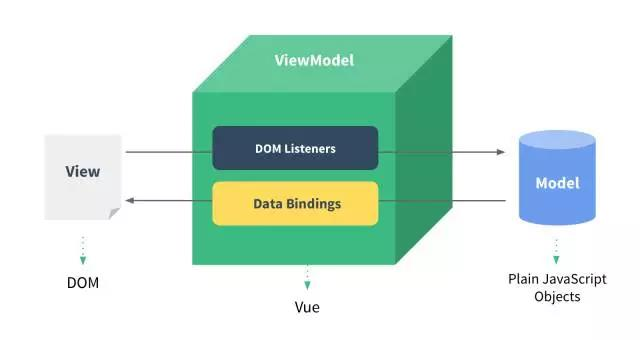

## Vue2.x 总结 ##

 > Vue 是一套用于构建用户界面的渐进式框架

 也意味着，既可以把VUE作为该应用的一部分嵌入到一个现成的服务端应用，或者在前后端分离的应用中，利用Vue 的核心库及其生态系统，把更多的逻辑放在前端来实现。


## A Progressive Framework ##
   **渐进式框架**

   与Vue相比，React学习曲线陡峭，在学习React之前，需要了解JSX和ES2015,当然入门后，发现还要学习React全家桶。而Vue就可以在简单阅读了文档后，开始构建应用程序。

   这就要得益于Vue主张的 **渐进式**。
   可以简单看下官方给出这张图：
   

  可以看出来，主要是介绍了Vue设计思想，就是框架做分层设计，每层都可选，可以单独引入，为不同的业务需求制定灵活的方案。主张最少，不会多做职责以外的事。

   [Vue作者尤雨溪的观点][1],Vue设计上包括的解决方案很多，但是使用者完全不需要一上手，就把所有东西全都用上，因为完全没有必要，一般都是根据项目的复杂度，在核心的基础上任意选用其他的部件，不一定要全部整合在一起。

   也就是，这样渐进式的解决方案，然后学习成本大大减少了。


## 声明式渲染 ##
 也就是说，DOM状态只是数据状态的一个映射，基本所有的框架都已经认同了这个看法，Vue也是主张 **数据驱动状态**。

 说到这里，基本都会提到现在主流的`MVVM`的模式。
 

 采用了双向数据绑定的思想，基本可以分为三层：
  - M(Model,模型层)，负责业务数据相关。
  - V(View,视图层)，视图相关，展示给用户的交互界面，同时捕获用户的操作
  - VM(ViewModel, V与M连接的桥梁，也可以看做控制器)。

基于这个思想，Vue从一开始就利用ViewModel与view，model进行交互
 
ViewModel是Vue.js的核心，它是一个Vue实例，作用在某个HTML元素上，一般都是指定 `id= app`的元素，图中 的`DOM listeners` 和`Data Bindings`可以看做两个工具，它们是实现双向数据绑定的关键。

   从用户(View)角度看，`DOM Liisteners`利用在相应的元素上添加事件绑定，捕获用户的点击，滑动等手势动作，在事件流中改变对应的`Model`。比如 常用的 `v-model` 指令，就是捕获表单元素的`input`，`change`等事件，改变相应的绑定值。

   从Model方向看，`Data Bindings`则将操作的数据变化，反应到view上。比如通过ajax 从后台获取的数据，可以刷新数据列表，反应到用户界面。这也是实现双向数据绑定的关键。

   Vue2中是通过`Object.definedProperty`方法中定义的getters和 setters构造器来实现数据响应的。可以简化下源码中的实现：
   ```
Object.defineProperty(obj, key, {
  enumerable: true,
  configurable: true,
  get: function reactiveGetter () {
    return value
  },
  set: function reactiveSetter (newVal) {
    var value = getter ? getter.call(obj) : val;
    /* eslint-disable no-self-compare */
    if (newVal === value || (newVal !== newVal && value !== value)) {
      return
    }
    /* eslint-enable no-self-compare */
    if ("development" !== 'production' && customSetter) {
      customSetter();
    }
    if (setter) {
      setter.call(obj, newVal);
    } else {
      val = newVal;
    }
    childOb = !shallow && observe(newVal);
    dep.notify();
  }
});
}
   ```
通过这种方法定义对象`obj`上的某个属性，每次获取属性值的时候就，会主动触发`get`对应的回调函数，然后给该属性赋值时，就会触发里面的`set`对应的回调函数，在`set`回调函数里面，加入了`dep.notify()`方法，然后可以[看下这个方法](https://github.com/vuejs/vue/blob/dev/src/core/observer/dep.js#L36)

```
notify () {
 // stabilize the subscriber list first
 const subs = this.subs.slice()
 for (let i = 0, l = subs.length; i < l; i++) {
   subs[i].update()
 }
}
```
里面的定义的常量`subs`每次深拷贝`this.subs`数组，数组里面保存的就是所有的`subscriber`订阅者,对应的发布者就是`obj`里面对应的属性，或者说是Vue中的`data`值。通知所有的订阅者，数据更新了。原生js实现发布订阅模式（publish/Subscribe)，[可以参考这里](http://www.cnblogs.com/TomXu/archive/2012/03/02/2355128.html)

## 常用基础语法 ##
### hello world  ###
 ```
   <!DOCTYPE html>
   <html>
     <head>
       <meta charset="utf-8">
       <title>hello world</title>
       <script src="https://gw.alipayobjects.com/as/g/h5-lib/vue/2.4.4/vue.min.js"></script>
     </head>
     <body>
       <div id="app">
         {{message}}
       </div>
       <script>
         var app = new Vue({
           el:"#app",
           data:{
             message:'hello vue'
           }
         })
       </script>
     </body>
   </html>
 ```
 这样就简单创建了一个Vue 应用，数据`message` 和DOM页面产生了关联，类似html模板引擎，把相应的数据渲染到页面中。

### 指令 ###
   指令 (Directives) 是带有 v- 前缀的特殊属性，这些特殊属性可以响应式的作用域DOM,
  - **v-if**  接受Boolean 类型,比如： `<p v-if = "seen">现在你看到我了</p> `，通过`seen`的真假来插入/移除< p>元素。 **这里判断的时候使用 === 全等，seen = “false” 的时候，也会插入**
  - **v-bind**,响应式的更新HTM属性。完整形式`<a v-bind:href="url">...</a>` 。  缩写形式`<a :href="url">...</a>`。 常用于改变dom的style, class ,href ,src 等属性。  动态绑定的属性可以写成   **:属性名="属性值" **

  - **v-on**，绑定点击事件,比如 完整形式`<a v-on:click="doSomething">...</a>`，简写形式 `<a @click="doSomething">...</a>`, `doSomething`对应的指向`methods`里面定义的函数。 注意，除非在需要传递参数的时候，写成 @click = "doSomething($event,args1,args2)",`$event`代表事件对象，`args`代表自定义参数


### style or class ###
  首先要使用到 `v-bind` 指令，可以归纳为带有`v-`前缀的特殊属性


参考链接
   - [Vue2.0 ，渐进式解决方案，Vue作者尤雨溪的观点][1]
   - [渐进式解决方案，知乎回答][2]
   - [MVC,MVP,MVVM 图示][3]
   - [vue.js 60分钟入门][4]
   - [如果实现双向数据绑定][5]
   - [Vue.js 源码： hello world 的背后](6)
   - [设计模式之观察者模式](7)


   [1]:https://mp.weixin.qq.com/s?__biz=MzIwNjQwMzUwMQ==&mid=2247484393&idx=1&sn=142b8e37dfc94de07be211607e468030&chksm=9723612ba054e83db6622a891287af119bb63708f1b7a09aed9149d846c9428ad5abbb822294&mpshare=1&scene=1&srcid=1026oUz3521V74ua0uwTcIWa&from=groupmessage&isappinstalled=0#wechat_redirect&utm_source=tuicool&utm_medium=referral

   [2]:https://www.zhihu.com/question/51907207

   [3]:http://www.ruanyifeng.com/blog/2015/02/mvcmvp_mvvm.html

   [4]:http://mp.weixin.qq.com/s/LePPVgNLKGnli7YaWVysHg
   [5]:https://github.com/DMQ/mvvm
   [6]:https://segmentfault.com/a/1190000006866881
   [7]:http://www.cnblogs.com/TomXu/archive/2012/03/02/2355128.html
